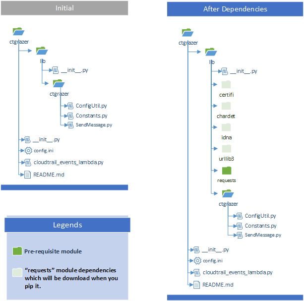

# CTGrazer #
**CTGrazer** is code you can use to create an *AWS Lambda* Function that will collect all of your *AWS CloudTrail* logs and efficiently send them to your *Splunk HEC (HTTP Event Collector)* server.

#### Why?
Using **CTGrazer** to port your AWS CloudTrail logs into Splunk has many advantages
* **Speed** *CloudTrail* logs are processed as soon as they become available
* **Security** All data is **encrypted** in transit and it does not rely on AWS IAM Access Keys
* **Scalable** CTGrazer will automatically **scale up** and down according to your needs
* **Reliable** If CTGrazer can't get your logs to their destination, it will **automatically retry** until it can
* **Cost Effectiveness** Pulling in **400K objects** a month will cost you about the same as a **cheeseburger!**

#### Pre-requisites
| **AWS**       | **Splunk**     | **Python**|
| :------------ | :------------- | :------------- | 
| **[Execution Permissions](https://docs.aws.amazon.com/lambda/latest/dg/with-s3.html):**   Put Trigger for *S3 Bucket* | **[HTTP Event Collector (HEC)](http://docs.splunk.com/Documentation/Splunk/7.1.1/Data/UsetheHTTPEventCollector) :**   *Authentication Token* | *Using Pip* - `pip install requests`   *If pip not allowed, direct download of all modules -* <ul><li>[Requests](https://files.pythonhosted.org/packages/b0/e1/eab4fc3752e3d240468a8c0b284607899d2fbfb236a56b7377a329aa8d09/requests-2.18.4.tar.gz)</li><ul><li>[Certifi](https://files.pythonhosted.org/packages/4d/9c/46e950a6f4d6b4be571ddcae21e7bc846fcbb88f1de3eff0f6dd0a6be55d/certifi-2018.4.16.tar.gz)</li><li> [Chardet](https://files.pythonhosted.org/packages/fc/bb/a5768c230f9ddb03acc9ef3f0d4a3cf93462473795d18e9535498c8f929d/chardet-3.0.4.tar.gz)</li><li> [Idna](https://files.pythonhosted.org/packages/65/c4/80f97e9c9628f3cac9b98bfca0402ede54e0563b56482e3e6e45c43c4935/idna-2.7.tar.gz)</li><li> [UrlLib](https://files.pythonhosted.org/packages/3c/d2/dc5471622bd200db1cd9319e02e71bc655e9ea27b8e0ce65fc69de0dac15/urllib3-1.23.tar.gz)</li></ul>

#### Splunk Cloud | HEC VPC Configurations

If you are a <b>Splunk Cloud Customer</b> and plan to use splunk indexers as HEC endpoint, you should NOT set any VPC settings for Lambda to be able to stream data to your indexers. Only setting required here is to open inbound SG's on Splunk Cloud to allow this traffic. If no VPC Settings are enabled, Lambda uses it's own endpoint which has internet access by default to connect to resources outside of your own VPC.

#### Splunk Internal | HEC VPC Configurations

For Internal HEC endpoints, VPC , subnets and SG rules need to be applied.

#### Configure, build and install
##### 1. Project Structure
 

##### 2. Download Requests Module 
CTGrazer uses Requests Module to perform HTTP calls. Download python Requests module and copy them under /lib folder.
##### 3. Config.ini
[REQUIRED PARAMETERS]
 
|**Parameter**|**Description**    |
|:------------|:------------------|
|**aws_s3_bucket_name**|Specify an AWS S3 bucket name to collect the CloudTrail logs|
|**aws_s3_bucket_prefix**|Specify the S3 subfolder location where the CloudTrail file object(s) are location|
|**splunk_hec_endpoint**|Specify splunk HTTP Event Collector endpoint of format https://[HEC_HOST]:[PORT]/services/collector/event|
|**splunk_hec_key**|Specify splunk HTTP Event Collector Key|
|**splunk_source_type**|Specify a value for the splunk sourcetype|

[OPTIONAL PARAMETERS]

|**Parameter**|**Description**    |
|:------------|:------------------|
|**batch_thread_size**|Specify the number threads to be used for event batch|
|**retry_sleep_time**|Time (in seconds) to sleep. Used when event is triggered but the object isn't there yet. Sleeps for the time specified and retries to get the object from S3|
|**minutes_to_process**|Time (in minutes) to process events that are older than the below specified minutes|
|**log_destination**|SPLUNK OR CLOUDWATCH (Default: CLOUDWATCH)|
|**log_message_prefix**|Sets the format for Lambda log processing events.|
|**debug**|Turn ON or OFF debugging|
|**splunk_debug_sourcetype**|Splunk sourcetype to use when logging debug messages|
 
##### 4. Deployment Package
* Create a zip file to be uploaded as a AWS Lambda Function. 
* Use [Automation](https://docs.aws.amazon.com/lambda/latest/dg/automating-deployment.html) process of your choice for deployment. 
* Configure S3 Put Trigger for the Cloudtrail Bucket - Event Trigger
* Configure CloudWatch Event Rule (Eg: 30 min) - Scheduled Trigger
* Configure applicable VPC, Security Group, Role Settings 
* Set Memory and Timeout limits (256MB , 5 mins)
